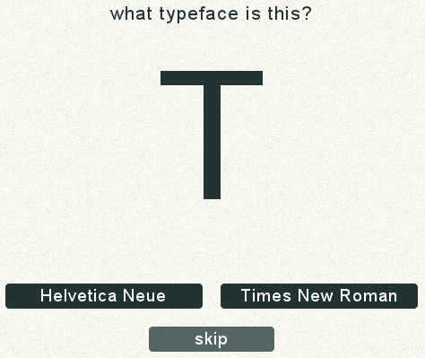
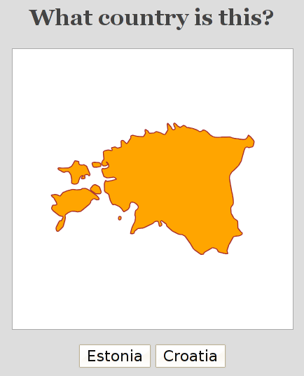
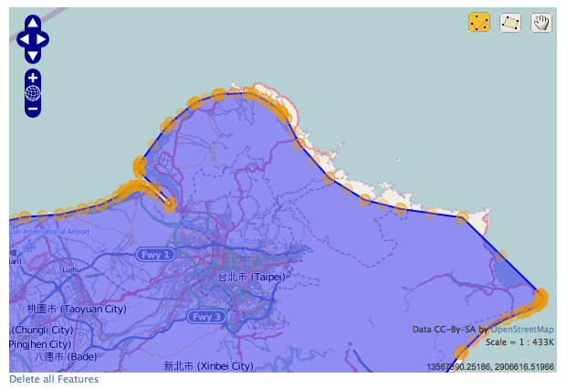
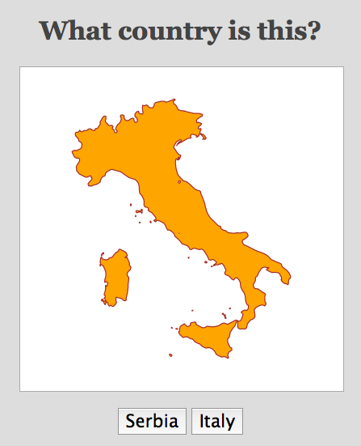
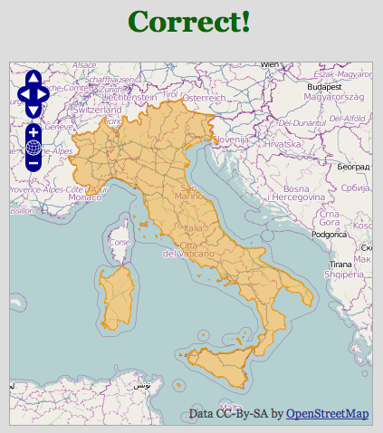

!SLIDE

# ➂ #
## Writing a game with contrib.gis ###

!SLIDE center

## Typewar ##

!SLIDE center

!SLIDE bullets

* Import countries data
* Disply a random country's shape
* Re-display it, on a map

!SLIDE code small

	@@@python
	INSTALLED_APPS += (
	    'django.contrib.gis',
	)

	DATABASES = {'default': {
	    'ENGINE': 'django.contrib.gis.db.backends.postgis',
	    # '...' ...,
	}}

!SLIDE code small

	$ createdb -T template_postgis -E UTF8 europythongame

	$ ./manage.py startapp countries

!SLIDE bullets

## World Borders data

* thematicmapping.org/downloads
* Shapefile

!SLIDE code smaller

# ogrinspect

	$ ./manage.py ogrinspect WORLD_BORDERS.shp Country \
		--srid=4326 --mapping --multi-geom > coutries/models.py

!SLIDE code smaller

	@@@python
	from django.contrib.gis.db import models

	class Country(models.Model):
	    fips = models.CharField('FIPS Code', max_length=2)
	    iso2 = models.CharField('2 Digit ISO', max_length=2)
	    iso3 = models.CharField('3 Digit ISO', max_length=3)
	    un = models.IntegerField('United Nations Code')
	    name = models.CharField('Name', max_length=50)
	    area = models.IntegerField()
	    pop2005 = models.IntegerField('Population in 2005')
	    region = models.IntegerField('Region Code')
	    subregion = models.IntegerField('Sub-Region Code')
	    lon = models.FloatField()
	    lat = models.FloatField()

	    geom = models.MultiPolygonField(srid=4326)

	    objects = models.GeoManager()

!SLIDE code small

	@@@python
	from django.contrib.gis.db import models

	class Country(models.Model):
	    # ...
	    geom = models.MultiPolygonField(srid=4326)

	    objects = models.GeoManager()

!SLIDE code small

	@@@python
	country_mapping = {
	    'fips': 'FIPS',
	    'iso2': 'ISO2',
	    'iso3': 'ISO3',
	    'un': 'UN',
	    'name': 'NAME',
	    'area': 'AREA',
	    'pop2005': 'POP2005',
	    'region': 'REGION',
	    'subregion': 'SUBREGION',
	    'lon': 'LON',
	    'lat': 'LAT',
	    'geom': 'MULTIPOLYGON',
	}

!SLIDE code small

	@@@python
	from django.contrib.gis.utils import LayerMapping

	lm = LayerMapping(Country, 'TM_WORLD_BORDERS-0.3.shp',
	                  country_mapping,
	                  encoding='iso-8859-1')

	lm.save(verbose=True)

!SLIDE bullets

# Admin

IMAGE ADMIN

!SLIDE code small bullets

## django.contrib.gis.admin.GeoModelAdmin

	@@@python

	from django.contrib.gis import admin
	from coutries.models import Country

	admin.site.register(Country, admin.GeoModelAdmin)
	admin.site.register(Country, admin.OSMGeoAdmin)

## django-floppyforms

!SLIDE bullets

# Floppyforms

* pip install django-floppyforms

* INSTALLED_APPS += ('floppyforms',)

* import floppyforms as forms

!SLIDE bullets

# GeoDjango widgets

* Base widgets: map backends (OSM, GMaps, ...)

* Geometry widgets

* Inherit from both

!SLIDE code small

	@@@python
	import floppyforms as forms

	class MultiPolygonWidget(forms.gis.MultiPolygonWidget,
	                         forms.gis.BaseOsmWidget):
	    pass

!SLIDE code small

	@@@python
	from countries.models import Country

	class CountryForm(forms.ModelForm):
	    class Meta:
	        model = Country
	        widgets = {
	            'geom': MultiPolygonWidget,
	        }

!SLIDE code small

	@@@python
	from django.contrib import admin

	class CountryAdmin(admin.ModelAdmin):
	    form = CountryForm

	admin.site.register(Country, CountryAdmin)

!SLIDE center

!SLIDE bullets smaller

# Spatial queries

	>>> from django.contrib.gis.geos import Point
	>>> from countries.models import Country

	>>> p = Point(11.27, 43.77)
	>>> Country.objects.filter(mpoly__contains=p)
	[<Country: Italy>]

!SLIDE bullets smaller

# Spatial queries

	>>> Country.objects.distance(p).order_by('distance')[:5]

	[<Country: Italy>, <Country: San Marino>, <Country: France>,
	<Country: Holy See (Vatican City)>, <Country: Croatia>]

!SLIDE bullets smaller

# Spatial queries

	it = Country.objects.get(name='Italy')

	# This is expensive
	>>> Country.objects.distance(it.mpoly).order_by('distance')[:5]

	[<Country: France>, <Country: San Marino>, <Country: Austria>,
	<Country: Slovenia>, <Country: Italy>]

!SLIDE bullets small

# Spatial queries

* https://docs.djangoproject.com/en/dev/ref/contrib/gis/db-api/

!SLIDE center

!SLIDE bullets

# Mapping Frameworks

* OpenLayers
* Google Maps
* Leaflet
* Polymaps
* Tile5

### SVG

!SLIDE code

	@@@python
	ct = Country.objects.order_by('?')

!SLIDE code

	@@@html
	

	<textarea class="hidden">
	    {{ ct.geom.geojson|safe }}
	</textarea>

!SLIDE code small

	@@@javascript
	var map = new OpenLayers.Map({
	    div: "map",
	    projection: "EPSG:900913",
	    maxExtent: new OpenLayers.Bounds(-20037508,
	                   -20037508,20037508,20037508),
	    maxResolution: 156543.0339,
	    units: 'm',
	    controls: []
	}),

	parser = new OpenLayers.Format.GeoJSON();
	features = parser.read($('textarea').innerHTML);

!SLIDE code small

	@@@javascript
	vector = new OpenLayers.Layer.Vector('Country'),
	map.addLayer(vector);
	map.setBaseLayer(vector);

	var src = new OpenLayers.Projection('EPSG:4326');
	var dst = map.getProjectionObject();

	for (var i=0; i<features.length; i++) {
	    feature = features[i];
	    features.geometry.transform(src, dst);
	}

	vector.addFeatures(features);
	map.zoomToExtent(vector.getDataExtent());

!SLIDE center

!SLIDE center

!SLIDE code small

	@@@python
	import floppyforms as forms

	class ReadOnlyWidget(forms.gis.MultiPolygonWidget,
	                     forms.gis.BaseOsmWidget):
	    template_name = 'questions/widget.html'

	class CountryForm(forms.Form):
	    country = forms.gis.MultiPolygonField(
	        widget=ReadOnlyWidget,
	    )

!SLIDE code

	@@@javascript
	

	{{ block.super }}

	options['modifiable'] = false;

	

!SLIDE code

	@@@python
	form = CountryForm(
	    initial={
	        'country': previous.country.geom,
	    },
	)

	{{ form.media }}
	{{ form }}

!SLIDE center

