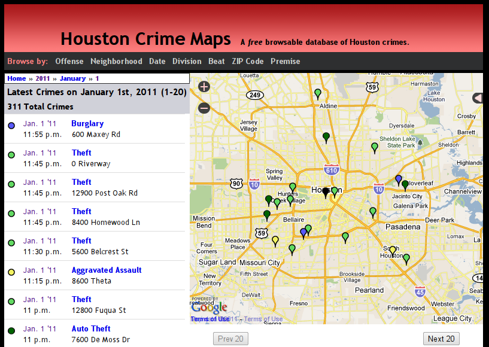
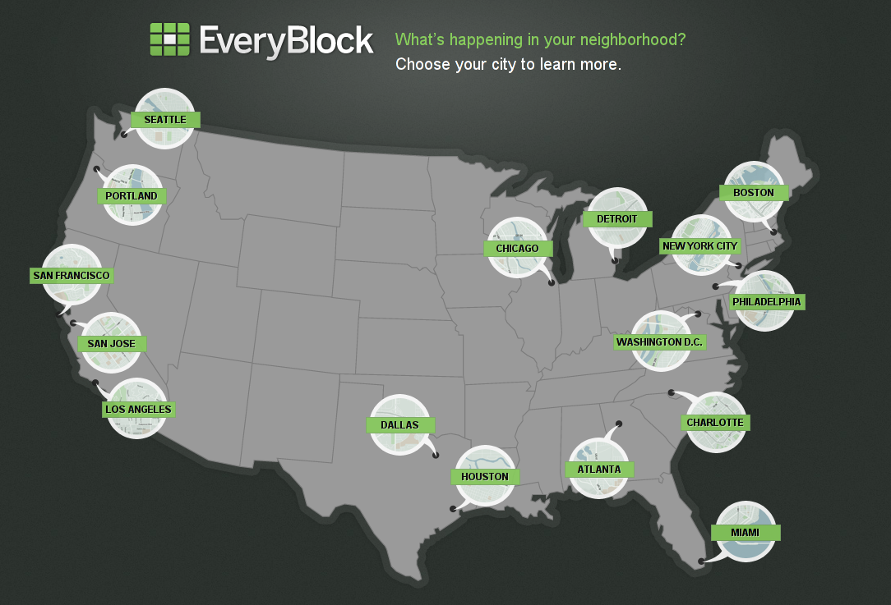

!SLIDE

# ➁
## GeoDjango

!SLIDE bullets

* Started by Justin Bronn in 2006-2007

* Merged into Django in 2008

* django.contrib.gis

!SLIDE full-size center

!SLIDE full-size

!SLIDE bullets

# Requirements

* Python + ctypes
* gdal, geos and proj.4 C libraries
* spatial database

!SLIDE bullets

# Spatial backends

### django.contrib.gis.db.backends

* SpatiaLite
* MySQL
* Oracle
* PostGIS

!SLIDE center

# Use PostGIS*

### *friends don't let friends use anything else

!SLIDE bullets

* Geographic Admin

* GEOS / GDAL

### django.contrib.gis.{geos,gdal}

* DataSource / LayerMapping

* Serialization (KML, GeoJSON, GeoRSS…)
