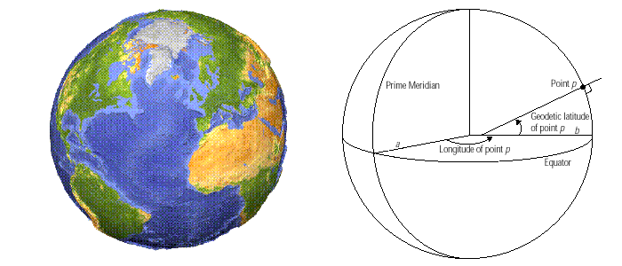
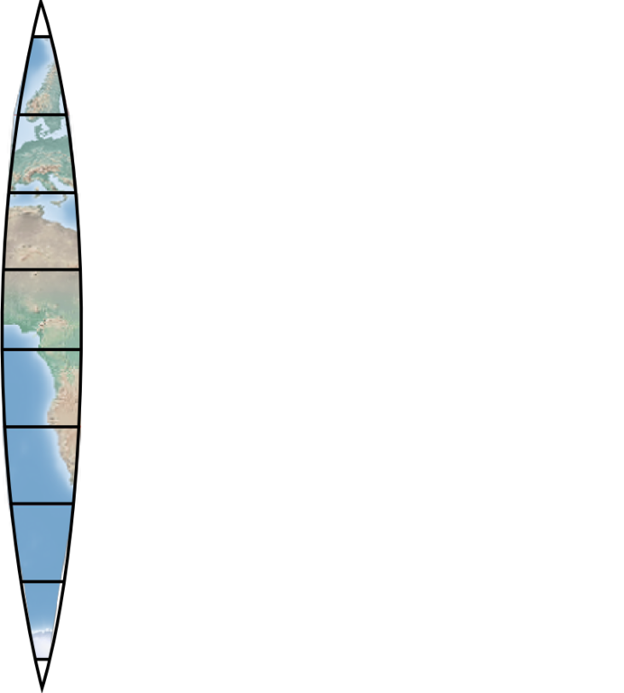
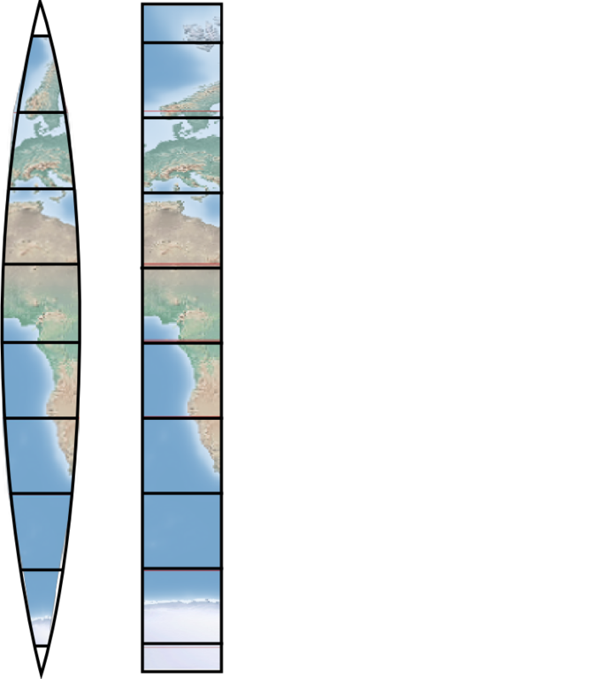
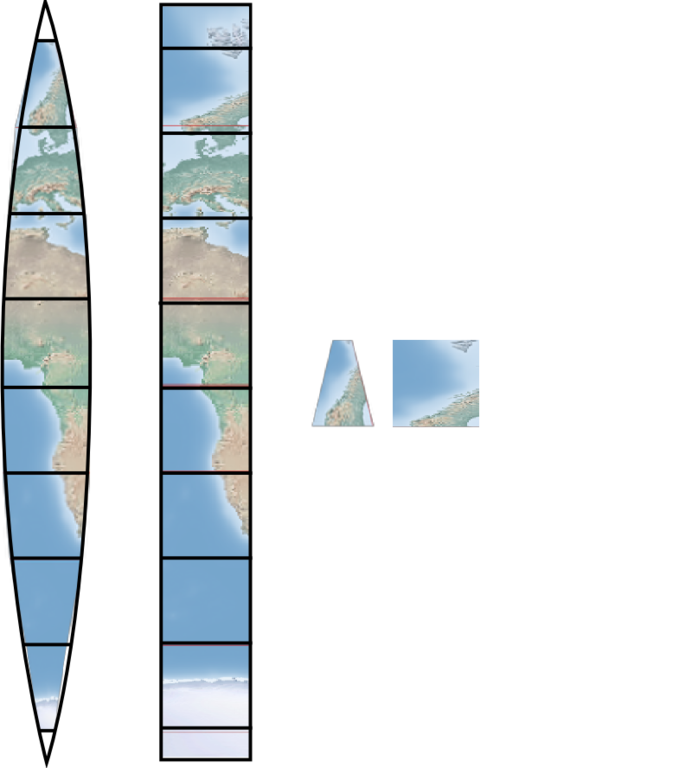
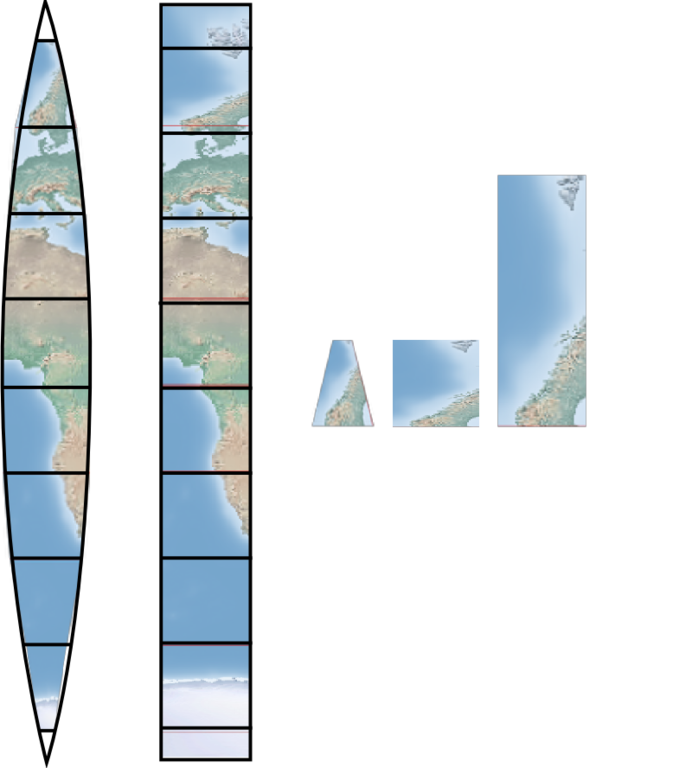
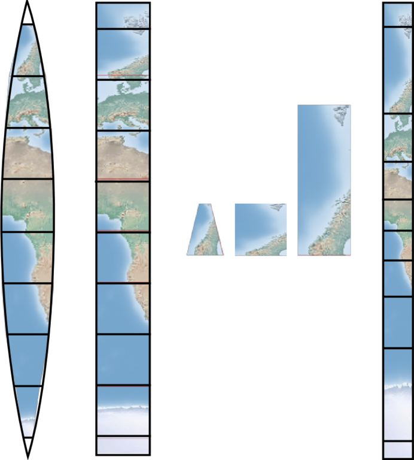
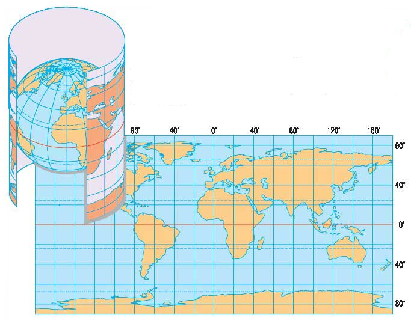
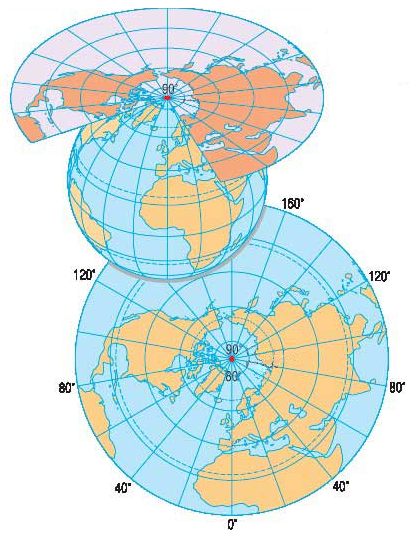
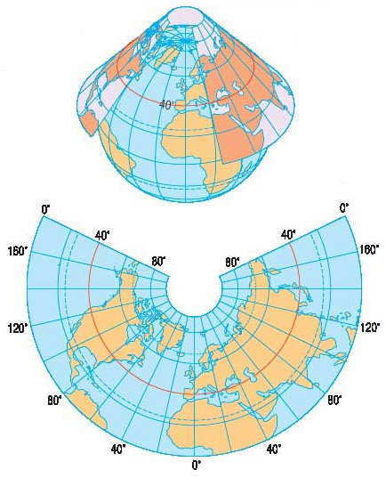
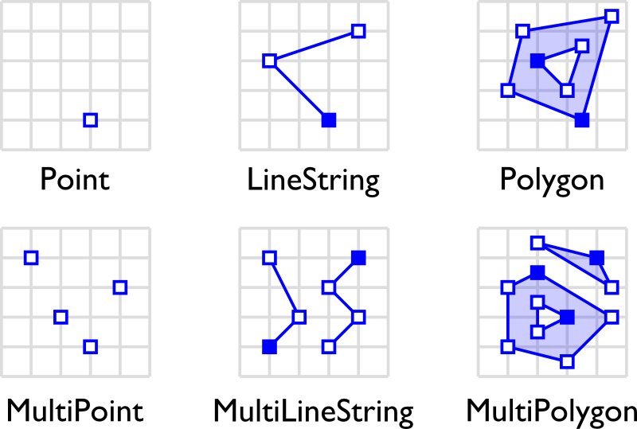

!SLIDE

# ➀ #
## GIS concepts ###

!SLIDE bullets

# GIS #

* Geographic Information Systems

!SLIDE bullets

# Coordinate Systems #

* Different ways to represent spatial data

!SLIDE bullets center

## **Geodetic** ##

* Coordinates = longitude / latitude

### datum: ellipsoidal approximation of the earth's surface. E.g. WGS 84 ###

!SLIDE bullets

## **Projected** ##

* Way to represent the curved surface on a flat surface

* Compromises on distortion

!SLIDE center

!SLIDE center

!SLIDE center

!SLIDE center

!SLIDE center

!SLIDE center bullets

* Cylindrical

!SLIDE center bullets

* Planar

!SLIDE center bullets

* Conical

!SLIDE center bullets

!SLIDE bullets

# Projections

* SRID, Spatial Reference ID
* spatialreference.org

### WGS 84: 4326
### Spherical Mercator: 900913 (now 3857) …

* SELECT COUNT(*) from spatial\_ref\_sys: 3749

!SLIDE bullets

# Standards #

* Open Geospatial Consortium

### SQL ###

### WKT, GeoJSON, KML, GML, WMS… ###

!SLIDE center

## Geometries ##

## Geometry, GeometryCollection ##

!SLIDE bullets

# Representation

## WKB

## WKT

### POINT (30 10)
### LINESTRING (30 10, 10 30, 40 40)
### GEOMETRYCOLLECTION(POINT(4 6), LINESTRING(4 6,7 10))

## GeoJSON

### {"type": "Point", "coordinates": [30, 10]}
